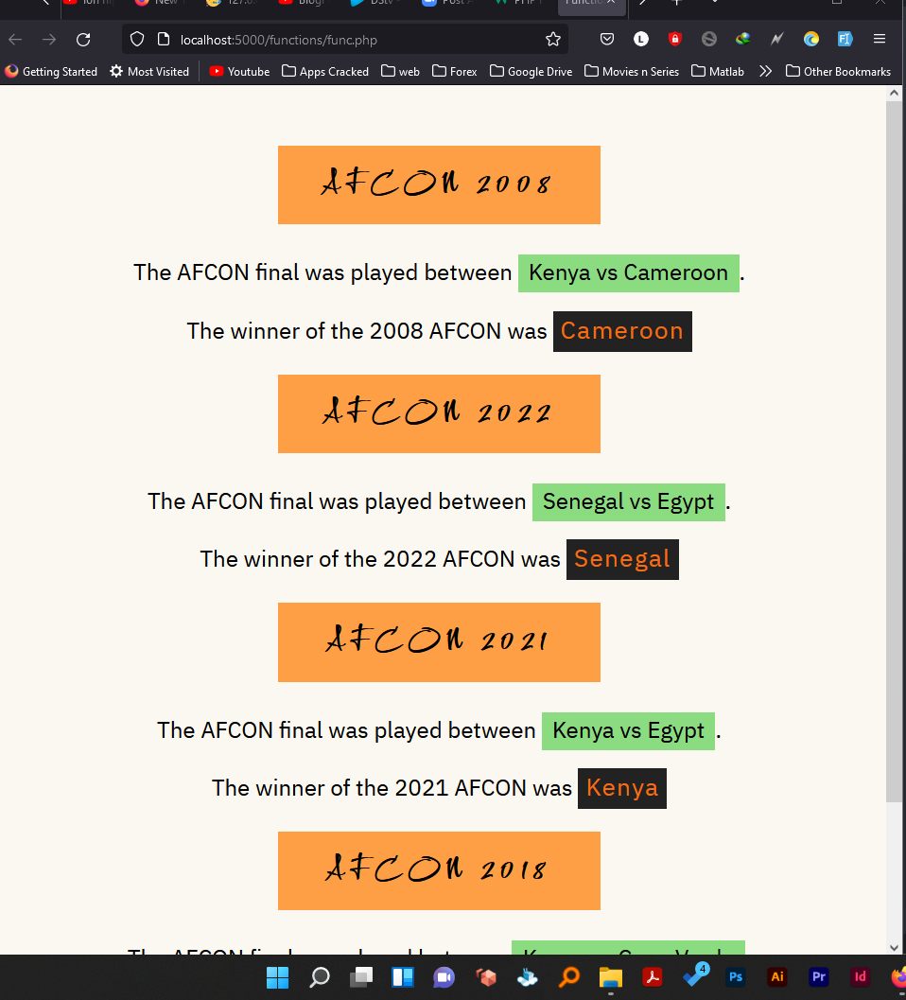

# eMobilis - Third Challenge/ Assignment(Function Challenge)

This is a solution to my third eMobilis Expolorer class Assignment
We were to learning on functions and were to create a function that takes multiple variables to achieve something 
NOTE : This still has my second challenge files and its README file can be found in the `master` or  `maaszaxxs` branches

## Table of contents

- [Overview](#overview)
- [My process](#my-process)
  - [Built with](#built-with)
  - [What I learned](#what-i-learned)
  - [Continued development](#continued-development)
  - [Useful resources](#useful-resources)
- [Author](#author)
- [Acknowledgments](#acknowledgments)

## Overview

- This is found in the `functions` folder inside this repository
-Function challenge in the functions folder

## My process

Added the function challenge which took four variables `year`, `first team` and `second team ` and used it to display the winner of that years AFCON cup.

 ### Screenshot

- The outcome of running the functions

### Built with

- PHP
- Semantic HTML5 markup
- CSS custom properties

### Continued development

 - I would like to have a huge collaboration with more than six people all doing a bit of a huge website 

## Author

- Website - [Lesley Kimutai](https://linktr.ee/les_kim)
- Frontend Mentor - [Leskim](https://www.frontendmentor.io/profile/Leskim)
- GitHub - [Leskim](https://github.com/Leskim)

## Acknowledgments

 - Collaborators : My friend [Collins Kibiwot] - [@kibithegreat](https://github.com/kibiwotkosgei)
                 : Charles Muia - GitHub - [Charles Muia ](https://github.com/Charles-Muia)
                 : Zacharia Njiraini - GitHub - [Zacharia Njiraini ](https://github.com/maaszaxxs)
 
